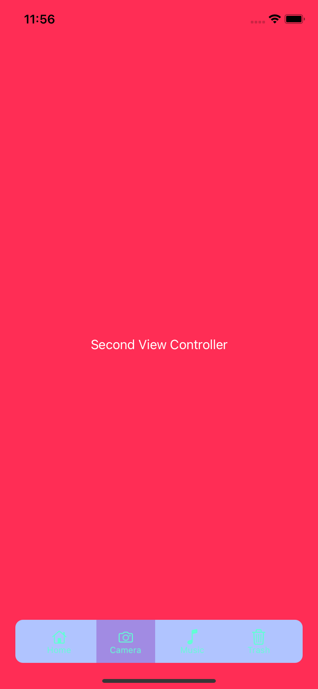
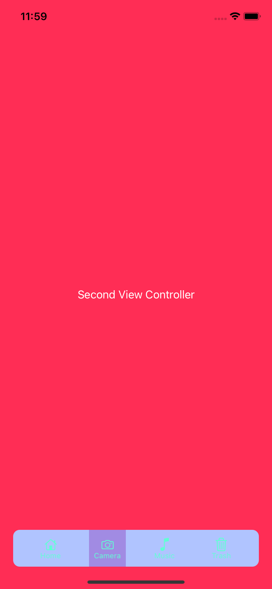
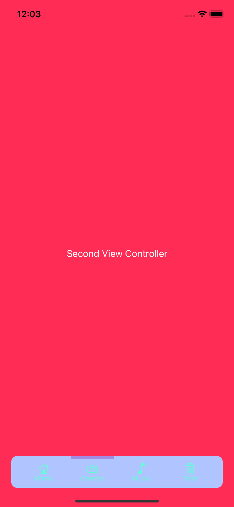
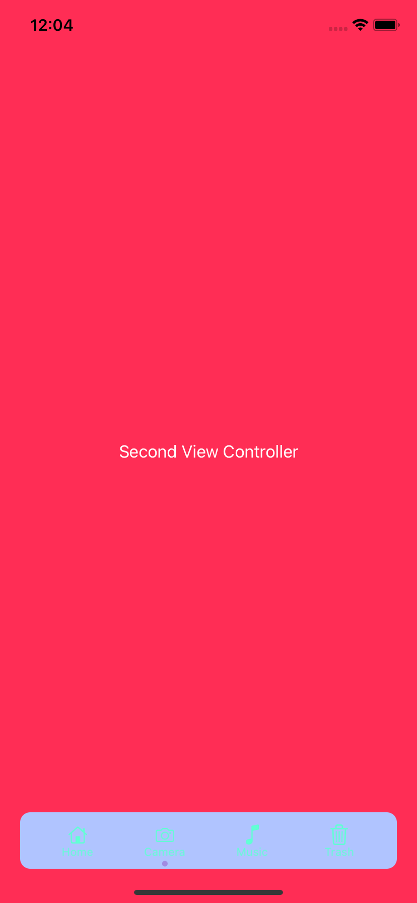
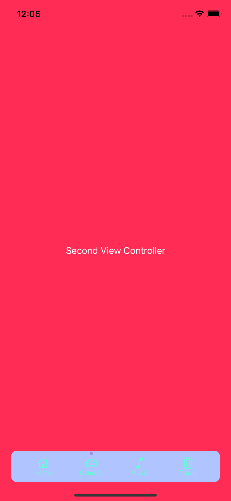
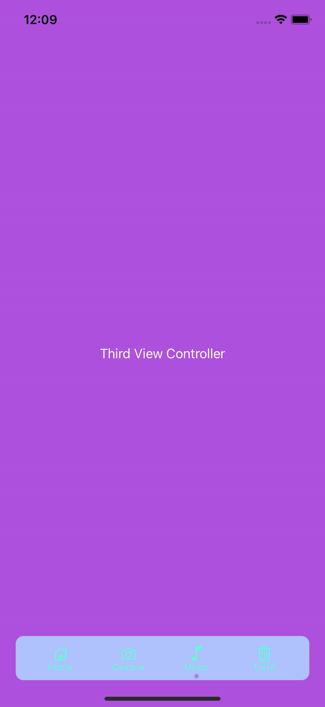
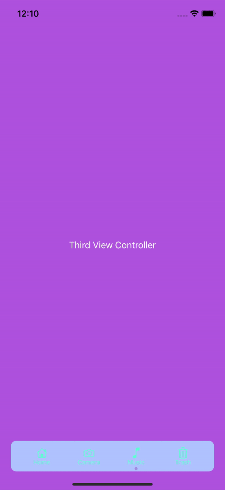
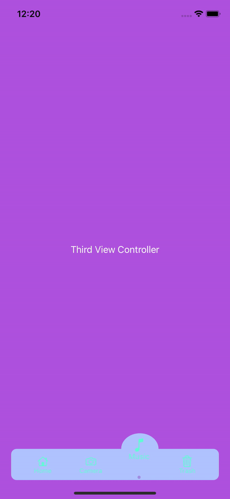
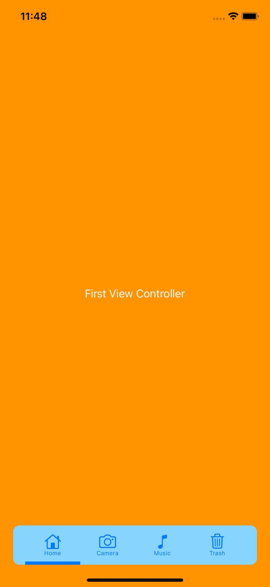

## Simple Animated Tab Bar

<p align="left"> 
  
   
  
  
</p>

## Table of contents
* [General info](#general-info)
* [Selection indicator types](#selection-indicator-types)
* [Tab bar item click animation types](#tab-bar-item-click-animation-types)
* [Auto layout support](#auto-layout-support)
* [Installation](#installation)
* [License](#license)
* [Contact](#contact)

## General info
Simple animated tab bar (UIView subclass) with @IBInspectable parameters. Contains: animated click on tab bar item, different selection indicator types, storyboards compatibility and autolayout.

## Selection indicator types

- None
- Rectangle
- Square
- Circle
- Down line
- Up line
- Down dot
- Up dot

<p align="center"> 
  
  
  
  
  
  
   
</p>

## Tab bar item click animation types

- None
- Rotate
- Flip horizontal
- Translate up

<p align="center"> 
  
  
  
</p>

## Auto layout support
<p align="center"> 
  
</p>

## Installation

SimpleAnimatedTabBar is available through [CocoaPods](https://cocoapods.org). To install
it, simply add the following line to your Podfile:

```ruby
pod 'SimpleAnimatedTabBar', '~> 0.1.3'
```

## License

SimpleAnimatedTabBar is available under the MIT license. See the LICENSE file for more info.

## Contact
<a href="https://www.linkedin.com/in/michał-nowak-53075a17a/">  </a>
<a href="https://twitter.com/mnowak061">  </a>
