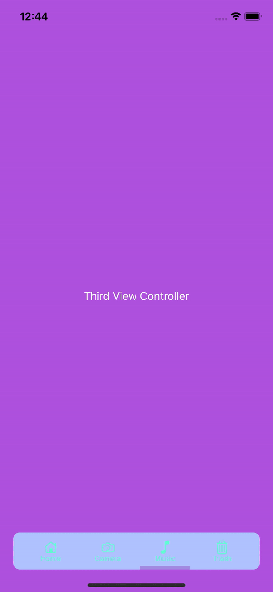
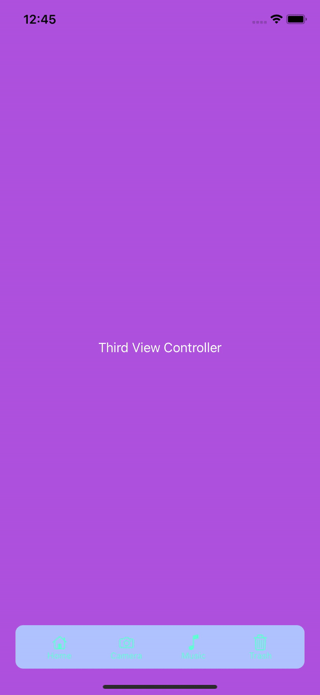

# SimpleAnimatedTabBar

[](https://travis-ci.org/michalnowak061/SimpleAnimatedTabBar)
[](https://cocoapods.org/pods/SimpleAnimatedTabBar)
[](https://cocoapods.org/pods/SimpleAnimatedTabBar)
[](https://cocoapods.org/pods/SimpleAnimatedTabBar)

## Selection indicator types

- None
- Rectangle
- Square
- Circle
- Down line
- Up line
- Down dot
- Up dot

<p align="center"> 
  
  
  
  
  
  
   
</p>

## Selection indicator types

- None
- Translate
- Blink

<p align="center"> 
  
  
</p>

## Tab bar item click animation types

- None
- Rotate
- Flip horizontal
- Translate up

<p align="center"> 
  
  
  
</p>

## Example

To run the example project, clone the repo, and run `pod install` from the Example directory first.

## Requirements

## Installation

SimpleAnimatedTabBar is available through [CocoaPods](https://cocoapods.org). To install
it, simply add the following line to your Podfile:

```ruby
pod 'SimpleAnimatedTabBar'
```

## Author

michalnowak061, michal.nowak061@gmail.com

## License

SimpleAnimatedTabBar is available under the MIT license. See the LICENSE file for more info.
