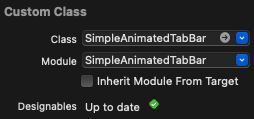
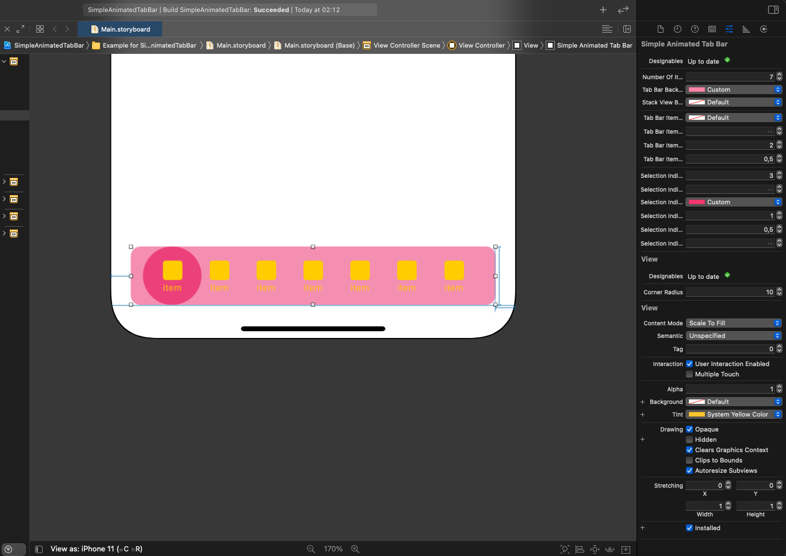

## Simple Animated Tab Bar

<p align="left"> 
  
   
  
  
</p>

## Table of contents
* [General info](#general-info)
* [How to use](#how-to-use)
* [Selection indicator types](#selection-indicator-types)
* [Tab bar item click animation types](#tab-bar-item-click-animation-types)
* [Auto layout support](#auto-layout-support)
* [Installation](#installation)
* [License](#license)
* [Contact](#contact)

## General info
Simple animated tab bar (`UIView` subclass) with `@IBInspectable` parameters. Contains: animated click on tab bar item, different selection indicator types, storyboards compatibility and autolayout.

## How to use

Change module to `SimpleAnimatedTabBar`. Inherit Module From Target must be unchecked:

<p align="center"> 
  
</p>

Add UIView to your for example ViewController in Storyboard, add constraints and change other parameters in attributes inspector:

<p align="center"> 
  
</p>

Create view controllers with identifier in Storyboard and keep them in viewControllers variable. Use delegate function's to setup tab bar item's icon and label and to select item event handling. If you want to have empty label set `item.name = ""`:

````swift
class ViewController: UIViewController {
    // MARK: -- Private variable's
    private var viewControllers: [UIViewController] = [
        UIStoryboard(name: "Main", bundle: nil).instantiateViewController(withIdentifier: "FirstViewController"),
        UIStoryboard(name: "Main", bundle: nil).instantiateViewController(withIdentifier: "SecondViewController"),
        UIStoryboard(name: "Main", bundle: nil).instantiateViewController(withIdentifier: "ThirdViewController"),
        UIStoryboard(name: "Main", bundle: nil).instantiateViewController(withIdentifier: "FourthViewController")
    ]
    
    // MARK: -- IBOutlet's
    @IBOutlet weak var simpleAnimatedTabBar: SimpleAnimatedTabBar!
    
    private var actualView: UIView?
    
    // MARK: -- Override's
    override func viewDidLoad() {
        super.viewDidLoad()
        // Do any additional setup after loading the view, typically from a nib.
        self.simpleAnimatedTabBar.delegate = self
        self.simpleAnimatedTabBar.selectedIndex = 2
    }
}

extension ViewController: SimpleAnimatedTabBarDelegate {
    func imageAndlabelForItem(_ simpleAnimatedTabBar: SimpleAnimatedTabBar, item: TabBarItem, atIndex index: Int) {
        switch index {
        case 0:
            item.image = UIImage(systemName: "house") ?? UIImage()
            item.name = "Home"
        case 1:
            item.image = UIImage(systemName: "camera") ?? UIImage()
            item.name = "Camera"
        case 2:
            item.image = UIImage(systemName: "music.note") ?? UIImage()
            item.name = "Music"
        case 3:
            item.image = UIImage(systemName: "trash") ?? UIImage()
            item.name = "Trash"
        default:
            break
        }
    }
    
    func simpleAnimatedTabBar(_ simpleAnimatedTabBar: SimpleAnimatedTabBar, didSelectItemAt index: Int) {
        guard index < self.viewControllers.count else {
            return
        }
        self.actualView?.removeFromSuperview()
        self.actualView = self.viewControllers[index].view
        self.view.insertSubview(self.actualView!, at: 0)
        self.actualView?.translatesAutoresizingMaskIntoConstraints = false
        
        let constraints = [
            self.actualView!.widthAnchor.constraint(equalTo: self.view.widthAnchor),
            self.actualView!.heightAnchor.constraint(equalTo: self.view.heightAnchor),
            self.actualView!.centerXAnchor.constraint(equalTo: self.view.centerXAnchor),
            self.actualView!.centerYAnchor.constraint(equalTo: self.view.centerYAnchor)
        ]
        NSLayoutConstraint.activate(constraints)
    }
}
````

## Selection indicator types

- None
- Rectangle
- Square
- Circle
- Down line
- Up line
- Down dot
- Up dot

<p align="center"> 
  
  
  
  
  
  
   
</p>

## Tab bar item click animation types

- None
- Rotate
- Flip horizontal
- Translate up

<p align="center"> 
  
  
  
</p>

## Auto layout support
<p align="center"> 
  
</p>

## Installation

SimpleAnimatedTabBar is available through [CocoaPods](https://cocoapods.org). To install
it, simply add the following line to your Podfile:

```ruby
pod 'SimpleAnimatedTabBar', '~> 0.1.3'
```

## License

SimpleAnimatedTabBar is available under the MIT license. See the LICENSE file for more info.

## Contact
<a href="https://www.linkedin.com/in/michał-nowak-53075a17a/">  </a>
<a href="https://twitter.com/mnowak061">  </a>
